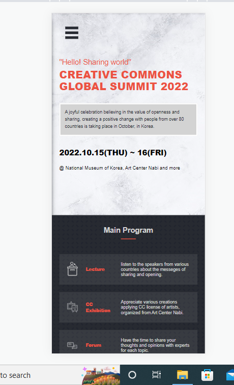
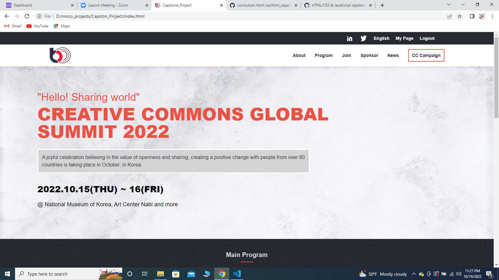

# Capston_Project

- Mobile ScreenShot
-
- Desktop ScreenShot
-
- [Video Demo](https://www.loom.com/share/81b9a47f596b4e678dc59548c8ed4cf3).

### Prerequisites

> Please Make sure to have upto date Browsers inorder to find the pages fully functional.

### Setup

> Inorder to setup the project, required to have a Hosting as well as Domain name.

## Built With

- HTML
- CSS
- Javascript

## live Demo
(https://zuhra-hashimi.github.io/Capston_Project/)

## Authors

👤 **Zuhra Hashimi**

- GitHub: [@ZuhRa-HashiMi](https://github.com/ZuhRa-HashiMi)
- Twitter: [@ZuhraHashimi4](https://twitter.com/ZuhraHashimi4)
- LinkedIn: [zuhra-hashimi](https://www.linkedin.com/in/zuhra-hashimi-601966214/)

## 🤝 Contributing

Contributions, issues, and feature requests are welcome!

## Design Credits

- Design: [@Cindy Shin in Behance](https://www.behance.net/gallery/29845175/CC-Global-Summit-2015)